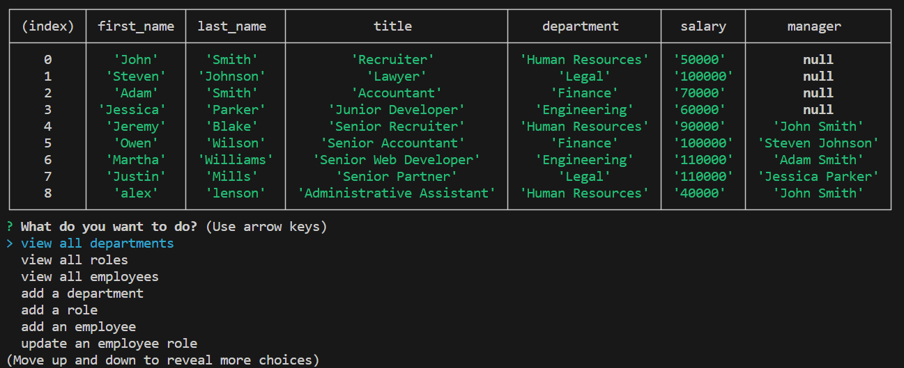

# Employee-Tracker
## Overview

The purpose of this project is to build a command-line application from scratch to manage a company's employee database, using Node.js, Inquirer, and MySQL. The application uses the Inquirer package to prompt the user in order to perform database queries to the employees database.
- Database is seeded with employees, roles and department data
- User is able to make queries to the employees database using prompts from the inquirer package

## Employee Tracker Database Example
Here is an example of a the employee tracker database.

## Video Demonstration
See a video demonstration: [Watch Video](https://drive.google.com/file/d/1D8j9SIlmFU6jFee9s-rXXX9UhQGrq23-/view)
